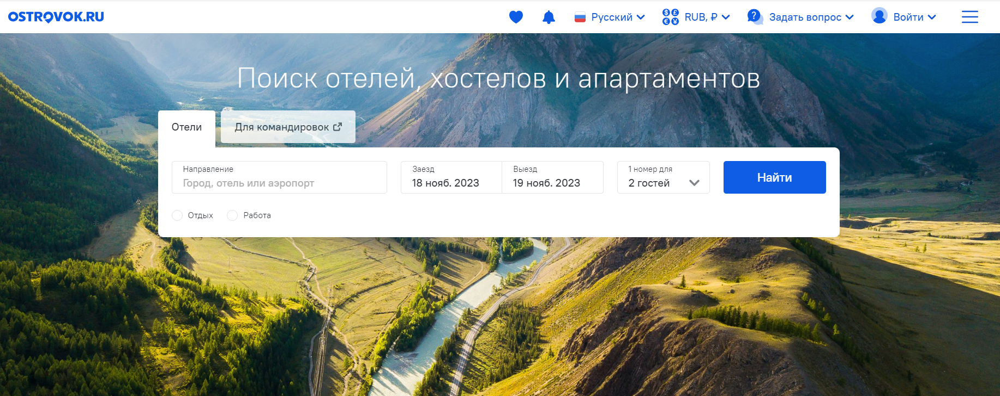
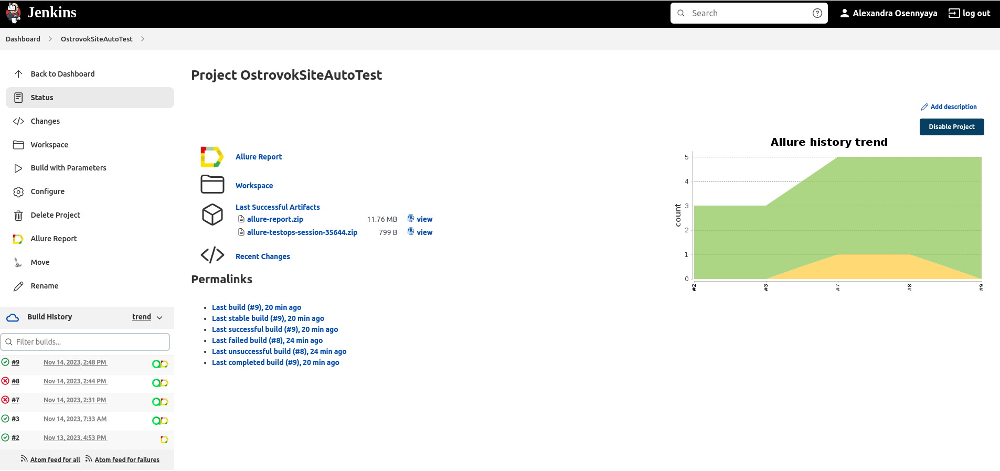

<h1> Проект по тестированию веб-сервиса бронирования отелей "Островок"</h1>

> <a target="_blank" href="https://ostrovok.ru">Ссылка на сайт</a>

#### Список проверок, реализованных в автотестах:
- [x] Поиск отелей по заданным фильтрам с главной страницы сайта
- [x] Изменение фильтров и повторный поиск отеля по заданным фильтрам
- [x] Добавление отеля в избранное
- [x] Удаление отеля из избранного
- [x] Открытие страницы Островок Командировки

### Проект реализован с использованием:

<table border="2">
  <tbody>
    <tr>
        <td>Python</td>
        <td>Pytest</td>
        <td>Selene</td>
        <td>Selenium</td>
        <td>Selenoid</td>
        <td>Jenkins</td>
        <td>Allure Reports</td>
        <td>Allure TestOps</td>
        <td>Jira</td>
    </tr>
  </tbody>
</table>

          

### Запуск автотестов выполняется на сервере Jenkins
> <a target="_blank" href="https://jenkins.autotests.cloud/job/008-oddfrog-python-8-15/">Ссылка на проект в Jenkins</a>

#### Параметры сборки

* environment (default stage). Параметр определяет окружение для запуска тестов

### Для запуска автотестов в Jenkins

#### 1. Открыть <a target="_blank" href="https://jenkins.autotests.cloud/job/008-oddfrog-python-8-15/">проект</a>

#### 2. Выбрать пункт **Build with Parameters**
#### 3. В случае необходимости изменить параметры, выбрав значение из выпадающего списков
#### 4. Указать комментарий
#### 5. Нажать **Build**
#### 6. Результат запуска сборки можно посмотреть в отчёте Allure

