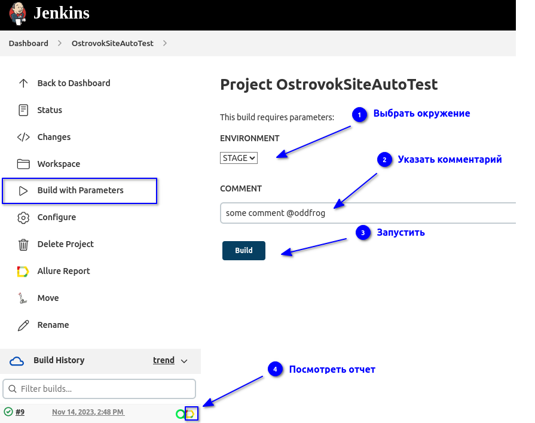
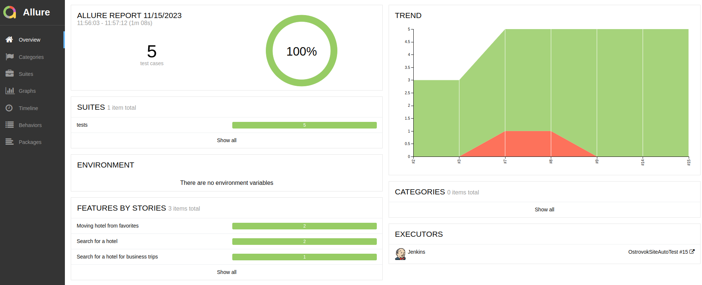
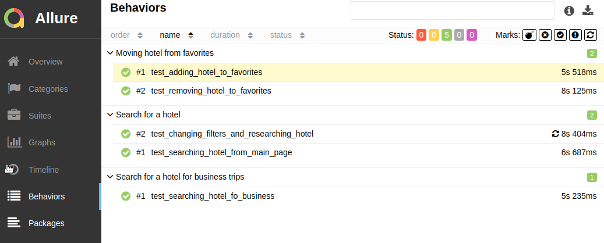
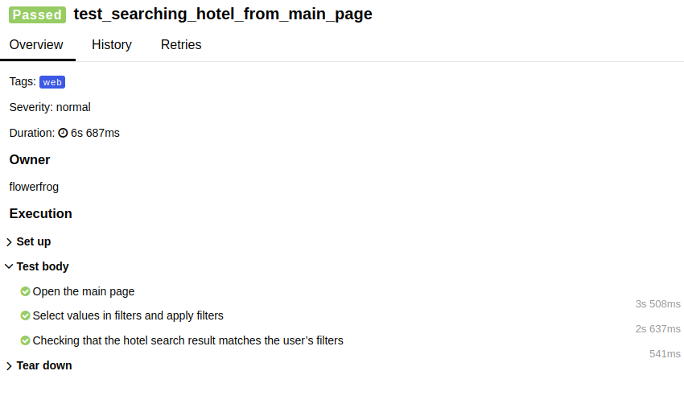
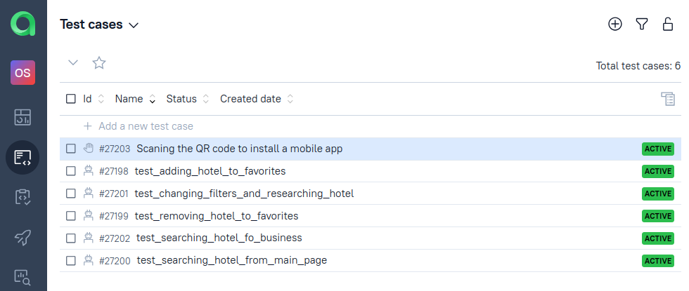
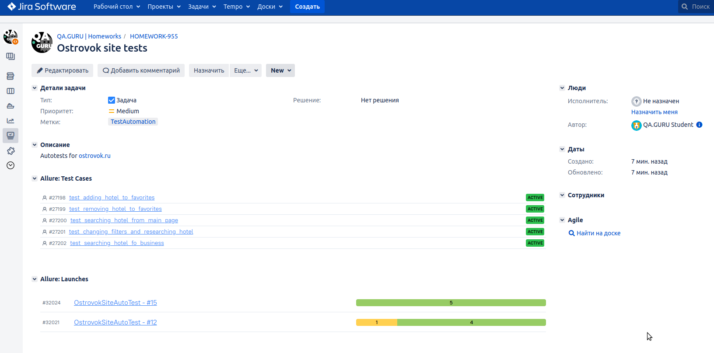
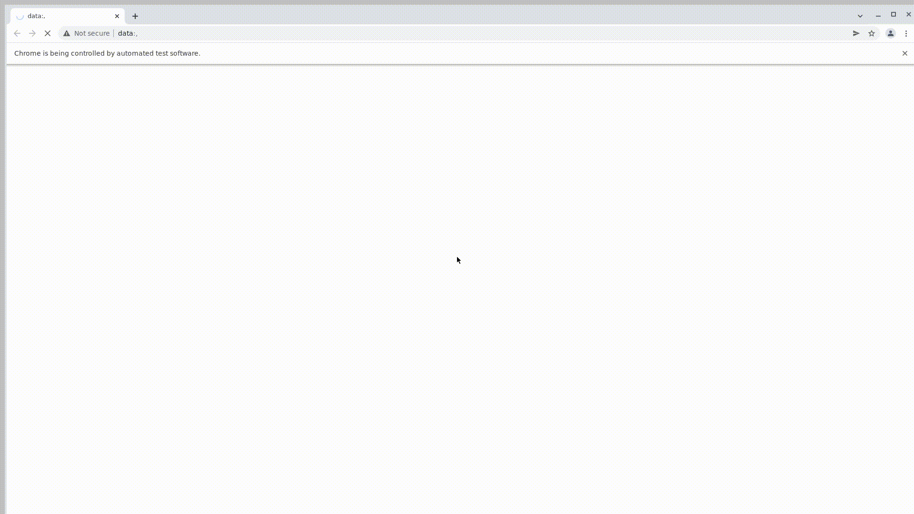

<h1> Проект по тестированию веб-сервиса бронирования отелей "Островок"</h1>

> <a target="_blank" href="https://ostrovok.ru">Ссылка на сайт</a>

#### Список проверок, реализованных в автотестах:
- [x] Поиск отелей по заданным фильтрам с главной страницы сайта
- [x] Изменение фильтров и повторный поиск отеля по заданным фильтрам
- [x] Добавление отеля в избранное
- [x] Удаление отеля из избранного
- [x] Открытие страницы Островок Командировки

----
### Проект реализован с использованием:

<table border="2">
  <tbody>
    <tr>
        <td>Python</td>
        <td>Pytest</td>
        <td>Selene</td>
        <td>Selenium</td>
        <td>Selenoid</td>
        <td>Jenkins</td>
        <td>Allure Reports</td>
        <td>Allure TestOps</td>
        <td>Jira</td>
    </tr>
  </tbody>
</table>

          

----
### Запуск автотестов выполняется на сервере Jenkins
> <a target="_blank" href="https://jenkins.autotests.cloud/job/OstrovokSiteAutoTest/">Ссылка на проект в Jenkins</a>

#### Параметры сборки

* `environment` - параметр определяет окружение для запуска тестов
* `comment` - комментарий

#### Для запуска автотестов в Jenkins

1. Открыть <a target="_blank" href="https://jenkins.autotests.cloud/job/OstrovokSiteAutoTest/">проект</a>
2. Выбрать пункт `Build with Parameters`
3. Выбрать окружение в выпадающем списке
4. Указать комментарий
5. Нажать кнопку `Build`
6. Результат запуска сборки можно посмотреть в отчёте Allure

----
### Allure отчет

#### Общие результаты

#### Список тест кейсов

#### Пример отчета о прохождении теста

----

### Полная статистика по прохождению тестпланов, отчёты и приложения к ним хранятся в Allure TestOps
> <a target="_blank" href="https://allure.autotests.cloud/project/3786/dashboards">Ссылка на проект в AllureTestOps</a> (запрос доступа `admin@qa.guru`)

#### Тест-планы проекта

#### Общий список всех кейсов, имеющихся в системе (без разделения по тест-планам и виду выполнения тестирования)

#### Пример отчёта выполнения одного из автотестов

#### Пример dashboard с общими результатами тестирования

----
### Интеграция с Jira
> <a target="_blank" href="https://jira.autotests.cloud/browse/HOMEWORK-955">Ссылка на проект в Jira</a>

----
### Оповещение о результатах прогона тестов в Telegram

----
### Пример видео прохождения автотеста

